Demo Package for HappyHops Project
==================================
  

Introduction
-------------
Happy Hops is a real-time marketing platform that enables bartenders to actively promote their deals and bar-environment directly to consumers who are looking for the right bar, right now, to socialize with their friends.

Preview
-------
Demo Link: [happyhops.herokuapp.com](happyhops.herokuapp.com)

User Scenario:

###Homepage
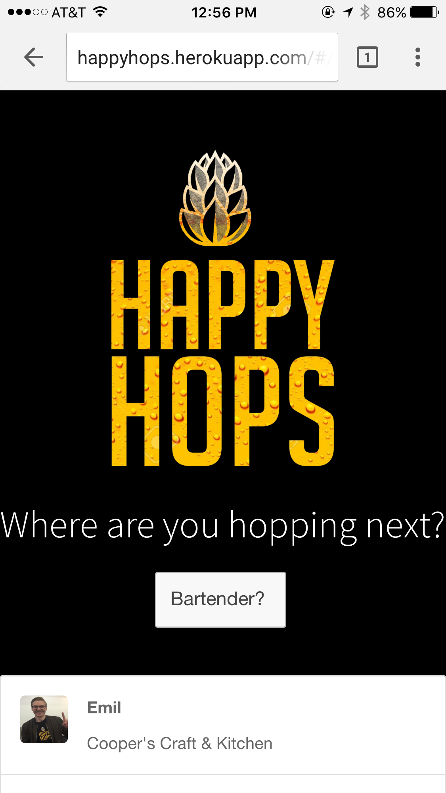

###Feeds
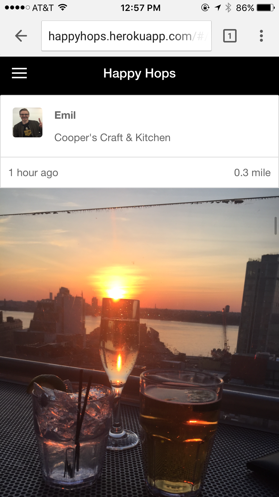

###Bartender Post
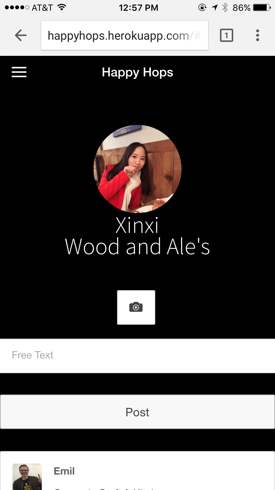

###Post Details
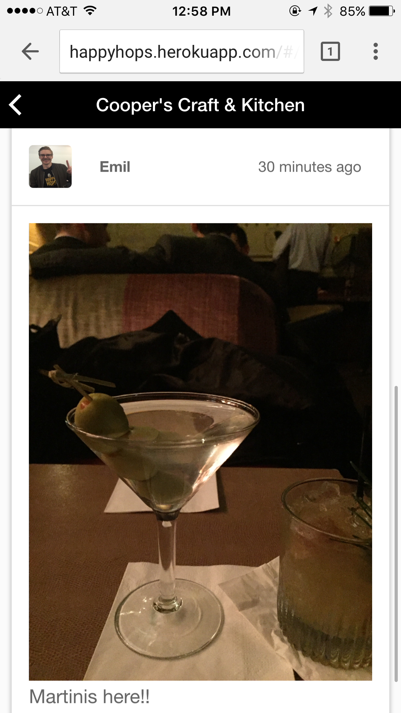
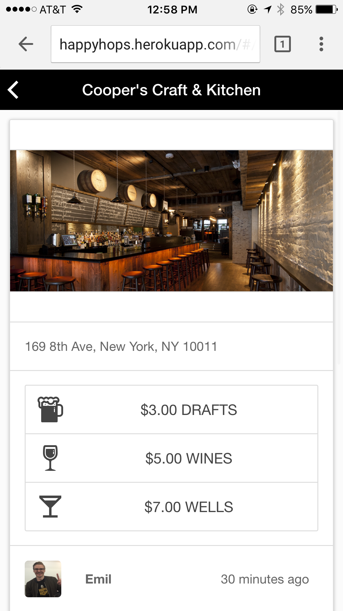

###Bar Catalog
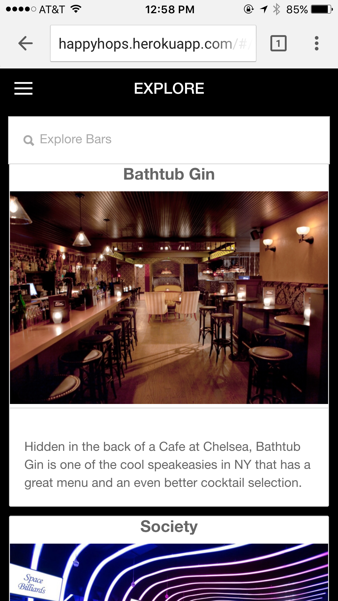
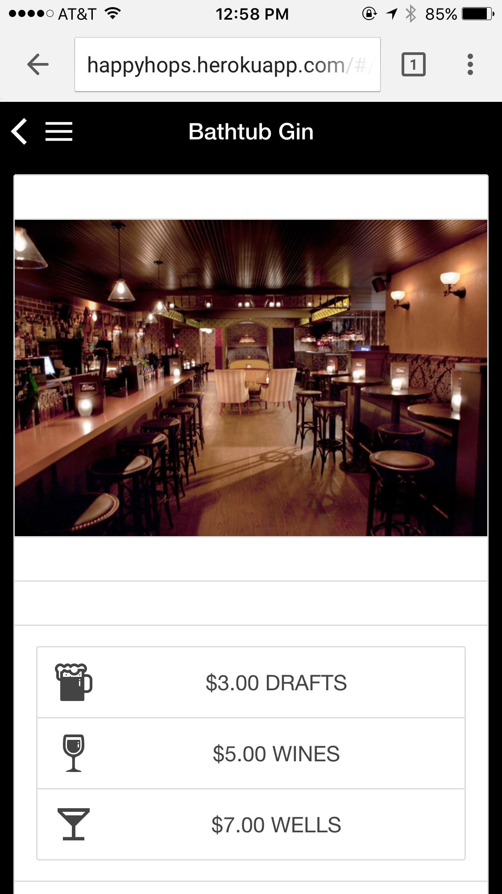

###Menu
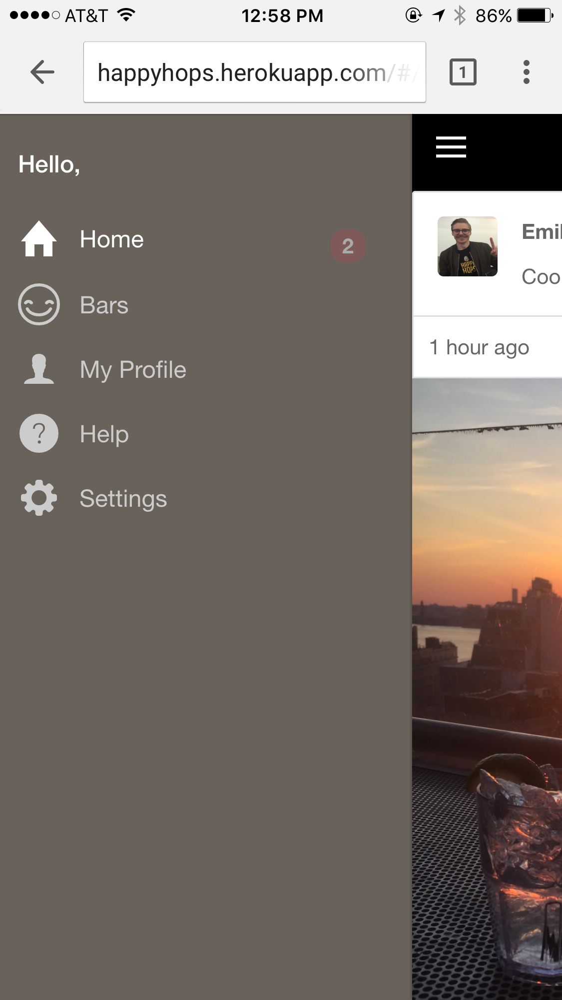

System Architecture
-------------------
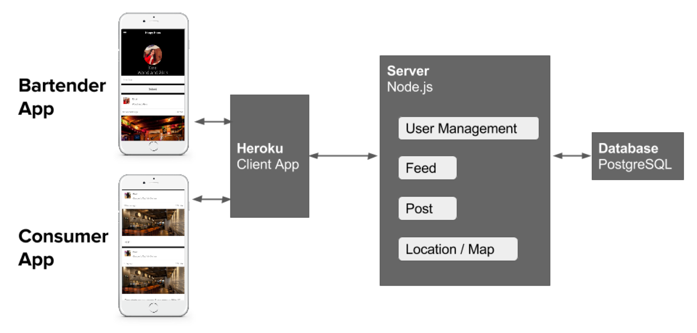

Database Design
-------------------
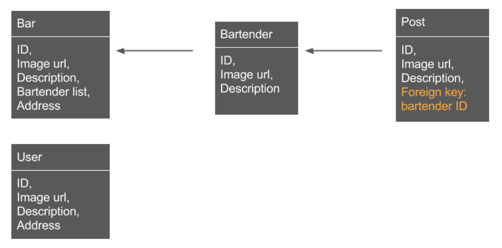

How does the Post Feature Works?
-------------------
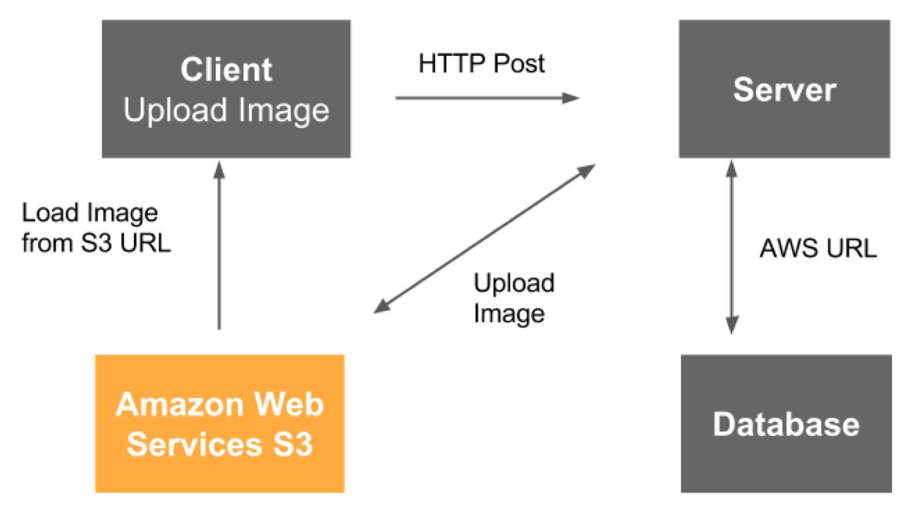

How To Use The Demo
-------------------
1. step
2. step

Deploy to Heroku
----------------
1. The app is already deployed to [happyhops.herokuapp.com](happyhops.herokuapp.com)
2. If you want to create deploy a new project, click the button below to set up:

Acknowledgement
---------------

